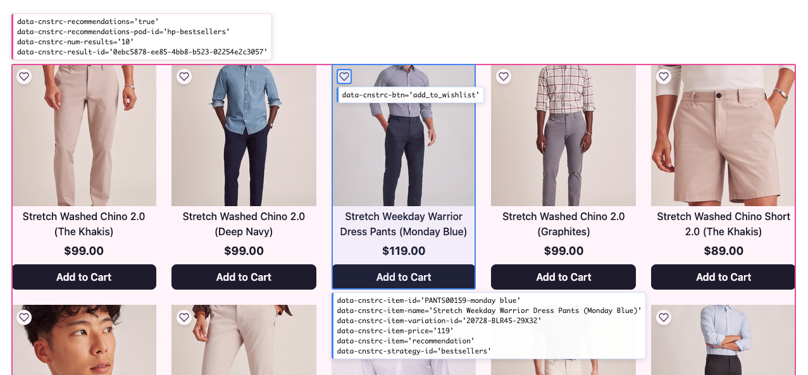

# Constructor Data Driven Tracking Example

[](https://github.com/Constructor-io/constructorio-example-data-driven-tracking/blob/master/LICENSE)

A React reference storefront that demonstrates how to surface [Constructor](https://constructor.com/) behavioral tracking through **data-driven event tracking** — the declarative `data-cnstrc-*` HTML attributes that let Constructor automatically capture user behavior without hand-wiring tracker calls.



[Constructor](https://constructor.com/) provides search as a service that optimizes results using artificial intelligence (including natural language processing, re-ranking to optimize for conversions, and user personalization). High-quality behavioral data is what powers that optimization, so getting tracking right is one of the most important parts of any integration.

This project exists to show, in real working code, **how a customer surfaces those attributes** across a complete shopping flow. The primary reference is the official guide:

> **[Data-Driven Event Tracking →](https://docs.constructor.com/docs/integrating-with-constructor-behavioral-tracking-data-driven-event-tracking)**

A live version of this application can be found on [Github Pages](https://constructor-io.github.io/constructorio-example-data-driven-tracking/).

## What is data-driven event tracking?

Instead of manually calling the tracker for every click, view, and conversion, you annotate your markup with `data-cnstrc-*` attributes. Constructor's tracking then reads the DOM and fires the correct behavioral events automatically. The model is hierarchical:

- **Container attributes** mark a region of the page (a search results grid, a browse listing, a recommendation pod).
- **Item attributes** mark each product inside a container and carry its identity (id, name, variation, price).
- **Action attributes** mark interactive elements (add-to-cart / add-to-wishlist buttons, the search form).

Get the nesting right and the events follow. This repo is a worked example of that nesting.

## Tracking surfaces in this example

Each Constructor surface is implemented as its own component so you can read the attributes in isolation.

| Surface | Container attribute | Key item / action attributes | Source |
| --- | --- | --- | --- |
| Search results | `data-cnstrc-search` | `data-cnstrc-search-term`, `data-cnstrc-result-id`, `data-cnstrc-num-results`, `data-cnstrc-result-page` | `src/components/Search/Search.jsx` |
| Zero-result search | `data-cnstrc-search` + `data-cnstrc-zero-result` | `data-cnstrc-search-term`, `data-cnstrc-num-results="0"` | `src/components/Search/Search.jsx` |
| Browse listing | `data-cnstrc-browse` | `data-cnstrc-result-id`, `data-cnstrc-filter-name`, `data-cnstrc-filter-value` | `src/components/Browse/index.jsx` |
| Autocomplete | `data-cnstrc-search-form` / `data-cnstrc-autosuggest` | `data-cnstrc-search-input`, `data-cnstrc-search-submit-btn`, `data-cnstrc-item-name` | `src/components/AutocompleteSearch/index.jsx` |
| Recommendations | `data-cnstrc-recommendations` | `data-cnstrc-recommendations-pod-id`, `data-cnstrc-result-id`, `data-cnstrc-strategy-id` | `src/components/Recommendations/` |
| Product card (item) | — | `data-cnstrc-item-id`, `data-cnstrc-item-name`, `data-cnstrc-item-variation-id`, `data-cnstrc-item-price` | `src/components/ProductCard.jsx` |
| Product detail page | `data-cnstrc-product-detail` | `data-cnstrc-item-id`, `data-cnstrc-item-name`, `data-cnstrc-item-variation-id`, `data-cnstrc-item-price` | `src/components/ProductPage/index.jsx` |
| Add to cart / wishlist | — | `data-cnstrc-btn="add_to_cart"`, `data-cnstrc-btn="add_to_wishlist"` | `ProductCard.jsx`, `ProductPage/index.jsx` |

## Attribute patterns by example

### Search results (container + items)

A search container declares the query context; each product card inside it carries its own identity. Constructor pairs the two to attribute clicks and conversions back to the search.

```jsx
// src/components/Search/Search.jsx
<Results
  resultData={{
    'data-cnstrc-search': '',
    'data-cnstrc-search-term': searchTerm,
    'data-cnstrc-result-id': resultId,
    'data-cnstrc-result-page': page,
  }}
/>
```

```jsx
// src/components/ProductCard.jsx — one item inside the container
<div
  data-cnstrc-item-id={product.data.id}
  data-cnstrc-item-name={product.value}
  data-cnstrc-item-variation-id={product.data?.variation_id}
  data-cnstrc-item-price={price}
>
```

### Zero-result searches

Zero-result views are tracked too, so you can measure and recover failed queries.

```jsx
// src/components/Search/Search.jsx
<div
  data-cnstrc-search
  data-cnstrc-zero-result
  data-cnstrc-search-term={searchTerm}
  data-cnstrc-num-results="0"
/>
```

### Recommendation pods

Recommendation containers add a pod id and strategy id so events are attributed to the right recommendation model.

```jsx
// src/components/Recommendations/RecommendationsResults.jsx
<div
  data-cnstrc-recommendations
  data-cnstrc-recommendations-pod-id={dataAttributes.dataCnstrcPodId}
  data-cnstrc-num-results={dataAttributes.dataCnstrcNumResults}
  data-cnstrc-result-id={dataAttributes.dataCnstrcResultId}
>
```

Items inside a recommendation pod mark themselves as recommendation items:

```jsx
// src/components/Recommendations/RecommendationCard.jsx
<div
  data-cnstrc-item="recommendation"
  data-cnstrc-item-id={product.data.id}
  data-cnstrc-strategy-id={product.strategy?.id}
>
```

### Conversion actions

Buttons declare the conversion they represent.

```jsx
// src/components/ProductPage/index.jsx
<button data-cnstrc-btn="add_to_cart">Add to cart</button>
<button data-cnstrc-btn="add_to_wishlist">Add to wishlist</button>
```

## The tracking overlay (developer aid)

The app ships a `CnstrcHighlighter` overlay (`src/components/CnstrcHighlighter.jsx`) that scans the live DOM for every `data-cnstrc-*` attribute and draws labeled highlight boxes over the matching elements. Toggle it while browsing to **visually confirm** which containers, items, and actions are being tracked and how they nest. It is a debugging aid for this example, not part of a Constructor integration.

## Getting started

Install dependencies via `npm`:

```bash
npm install
```

Start the development server:

```bash
npm run start
```

When running, the application is available at http://localhost:3000/.

## Available commands

```bash
npm run start   # start the development server on localhost:3000
npm run build   # produce a production build in ./build
npm run test    # run the test suite
npm run deploy  # publish ./build to Github Pages
```

## Built with

- [React 18](https://react.dev/) with [React Router 6](https://reactrouter.com/)
- [@constructor-io/constructorio-client-javascript](https://github.com/Constructor-io/constructorio-client-javascript) — search, browse, autocomplete, recommendations, and tracking
- [@constructor-io/constructorio-ui-autocomplete](https://github.com/Constructor-io/constructorio-ui-autocomplete) — autocomplete UI
- [Tailwind CSS](https://tailwindcss.com/) for styling
- [Webpack](https://webpack.js.org/) build tooling (Create React App based)

## Further resources

- [Data-driven event tracking guide](https://docs.constructor.com/docs/integrating-with-constructor-behavioral-tracking-data-driven-event-tracking) — the primary reference this example illustrates
- [Constructor documentation](https://docs.constructor.com/)
- [JavaScript client documentation](https://constructor-io.github.io/constructorio-client-javascript/index.html)
